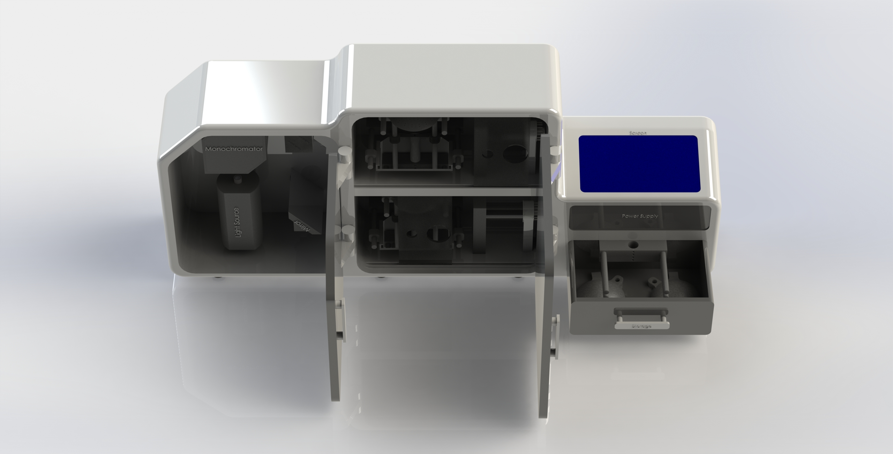

# CAD-Skills-1: UV-Vis Spectrophotometer

This project showcases a custom-designed UV-Vis Spectrophotometer. All parts were modeled and assembled by me. 

> 📁 Some files are excluded due to confidentiality. 

🔧 Check the **Photos Of Final Assembly** folder for the final design.

Update: As the idea was sold and I had not signed any NDA, we were working on levitator based UV-Vis Spectrophotometer. This was concept of how the product would be designed.

Thanks for visiting! 

